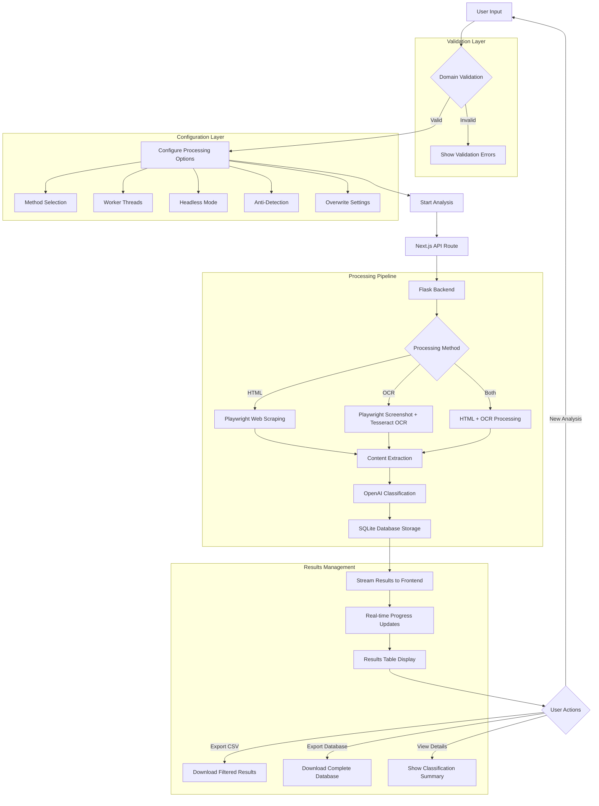
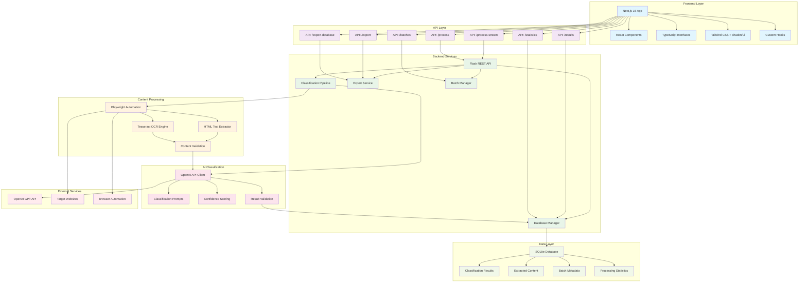

# Bulk Website Classifier


A modern web application for classifying websites in bulk using AI-powered analysis. Features multiple interfaces including a Next.js web app, Streamlit interface, and CLI tool. Built with Flask backend and powered by OpenAI for intelligent website categorization.

[](https://nextjs.org/)
[](https://www.typescriptlang.org/)
[](https://www.python.org/)
[](https://flask.palletsprojects.com/)
[](https://openai.com/)
[](https://playwright.dev/)

[](https://reactjs.org/)
[](https://tailwindcss.com/)
[](https://www.sqlite.org/)
[](https://streamlit.io/)

## Features

- **Multiple Interfaces**: Modern Next.js web app, Streamlit webapp, and CLI tool
- **AI-Powered Analysis**: OpenAI/Azure OpenAI powered categorization with confidence scoring  
- **Streaming Processing & Real-time Updates**: Track processing status with live updates and see results as they come in
- **Content Extraction**: HTML parsing + OCR for comprehensive text extraction
- **Database Storage**: SQLite database with full content storage and advanced querying
- **Domain Validation**: Real-time validation with duplicate removal and error feedback
- **Flexible Configuration**: Choose between HTML and OCR analysis methods
- **Results Management**: Filter, search, and export classification results
- **Modern UI**: Built with Next.js and shadcn/ui for a polished user experience
- **Batch Processing**: Handle multiple domains efficiently with batch tracking
- **Export Capabilities**: CSV export with filtering options and complete database export

## Prerequisites

- Python 3.8+
- Node.js 18+ (for Next.js frontend)
- Tesseract OCR installed:
  - **macOS**: `brew install tesseract`
  - **Ubuntu/Debian**: `sudo apt-get install tesseract-ocr`
  - **Windows**: Download from [GitHub releases](https://github.com/UB-Mannheim/tesseract/wiki)

## Setup

### 1. Backend Setup

```bash
# Create and activate virtual environment
python3 -m venv venv
source venv/bin/activate  # On Windows: venv\Scripts\activate

# Install dependencies
pip install -r requirements.txt

# Install Playwright browsers
playwright install

# Create environment file
cp .env.example .env
# Edit .env with your OpenAI API key
```

### 2. Frontend Setup (Optional)

```bash
cd website-classifier
npm install
npm run build
```

### 3. Environment Configuration

Create a `.env` file with your API credentials:

```bash
# OpenAI Configuration
OPENAI_API_KEY=your_api_key_here

# Or Azure OpenAI Configuration
AZURE_OPENAI_API_KEY=your_azure_api_key
AZURE_OPENAI_ENDPOINT=https://your-resource.openai.azure.com/
AZURE_OPENAI_API_VERSION=2024-02-15-preview
AZURE_OPENAI_DEPLOYMENT_NAME=your-deployment-name
```

## Quick Start

### Recommended: Use the Next.js Web Application

```bash
# 1. Clone and setup
git clone <repository-url>
cd bulk-web-describer

# 2. Setup environment
echo "OPENAI_API_KEY=your_openai_api_key_here" > .env

# 3. Start both backend and frontend
chmod +x start.sh
./start.sh
```

The application will be available at [http://localhost:3000](http://localhost:3000)

### Alternative Interfaces

```bash
# Streamlit App (http://localhost:8501)
streamlit run streamlit_app.py

# CLI Tool
python run_CLI_pipeline.py
```

## Usage

### Next.js Web App (Recommended)

1. **Input Domains**: Enter website URLs in the textarea (one per line). Invalid domains will be flagged.
2. **Configure Settings**: 
   - Choose text extraction method (HTML Parsing or OCR Screenshots)
   - Set worker threads for parallel processing (1-8)
   - Enable/disable headless mode for browser automation
   - Optionally enable anti-detection measures
   - Decide whether to overwrite existing results for previously scanned domains
3. **Start Analysis**: Click "Start Analysis" to begin
4. **Monitor Progress**: Observe real-time progress with individual domain status and overall completion
5. **Review Results**: View classified websites in the sortable and searchable results table
6. **View Detailed Summary**: Click the eye icon to see detailed summaries for specific domains
7. **Export Data**: Download results as a CSV file for further analysis

### CLI Usage

```bash
# Basic classification
python run_CLI_pipeline.py

# Advanced options
python run_CLI_pipeline.py \
  --method both \
  --domains custom_domains.txt \
  --workers 8 \
  --headful \
  --anti-detection
```

### Database Management

The system includes powerful database management and export tools:

```bash
# View database information and statistics
python -c "from src.database import ClassificationDatabase; db = ClassificationDatabase(); print(db.get_database_info())"

# View classification statistics
python -c "from src.database import ClassificationDatabase; db = ClassificationDatabase(); print(db.get_statistics())"

# View processing batches
python -c "from src.database import ClassificationDatabase; db = ClassificationDatabase(); print(db.get_batches())"

# Optimize database performance
python -c "from src.database import ClassificationDatabase; db = ClassificationDatabase(); db.vacuum_database()"
```

**CLI Options:**
- `--method [html|ocr|both]`: Text extraction method (default: html)
- `--domains <file>`: Input domains file (default: domains.txt)
- `--workers <num>`: Parallel threads (default: 4)
- `--headful`: Visible browser mode
- `--anti-detection`: Anti-bot measures
- `--overwrite`: Reprocess all domains

### Frontend Features

The Next.js frontend provides an intuitive interface with:

- **Real-time Processing**: Live updates during batch processing with duration tracking
- **Domain Validation**: Real-time domain validation with duplicate detection and error feedback
- **Advanced Configuration**: Customizable processing options
- **Database Export**: One-click export of entire database to CSV
- **Animated Interface**: Modern UI with animated backgrounds and loading states
- **Theme Toggle**: Dark/light mode support
- **Backend Health Monitoring**: Real-time status indicators

### Input Format

Create a `domains.txt` file with one domain per line:

```
github.com
stackoverflow.com
reddit.com
```

## API Endpoints

The Flask backend provides REST API endpoints:

- `GET /results` - Query results with filtering (includes full content)
- `GET /statistics` - Real-time statistics
- `GET /batches` - Batch management and metadata
- `GET /export-database` - Export complete database content
- `POST /export/csv` - Export filtered CSV with full content
- `GET /health` - System health check

Example:

```bash
# Get portal sites with full content
curl "http://localhost:5001/results?label=Portal&limit=10"

# Export complete database
curl "http://localhost:5001/export-database"

# Export filtered results with full extracted content
curl -X POST http://localhost:5001/export/csv \
  -H "Content-Type: application/json" \
  -d '{"filename": "portals_with_content.csv", "filters": {"label": "Portal"}}'

# Get specific batch results
curl "http://localhost:5001/results?batch_id=batch_20250525_123456"
```

## Architecture Overview

### Application Flow Diagram



### System Architecture Diagram



## Tech Stack

### Frontend
- **Next.js 15**: React framework with App Router
- **TypeScript**: Type-safe development
- **Tailwind CSS**: Utility-first styling
- **shadcn/ui**: Modern component library
- **Lucide React**: Icon library
- **React Hooks**: Custom hooks for state management

### Backend
- **Flask**: Python web framework with REST API
- **SQLite**: Database for storing results and content
- **OpenAI API**: GPT-powered text analysis and classification
- **Playwright**: Modern web scraping and automation
- **Tesseract OCR**: Optical character recognition
- **Python Libraries**: pandas, requests, concurrent.futures

### Alternative Interfaces
- **Streamlit**: Rapid prototyping web interface
- **CLI Tool**: Command-line interface for batch processing

## Project Structure

```
├── src/                    # Core modules
│   ├── database.py         # SQLite database with content storage
│   ├── fetcher_enhanced.py # Web scraping with Playwright
│   ├── text_extractor.py   # HTML text extraction
│   ├── ocr_module.py       # OCR processing
│   ├── writer.py          # Database and CSV output handling
│   └── openai_client.py    # AI classification
├── website-classifier/     # Next.js frontend with database export
├── streamlit_app.py        # Streamlit interface
├── flask_backend_enhanced.py # Flask API server with export endpoints
├── run_CLI_pipeline.py     # CLI tool with content storage
└── start.sh               # Startup script
```

## Customization

### Adding Classification Categories

Edit `src/openai_client.py` and update the `CLASSIFY_SITE_TOOL` enum:

```python
"classification_label": {
    "type": "string", 
    "enum": ["Marketing", "Portal", "Other", "Error", "YourCategory"],
    "description": "Classification categories"
}
```

### Database Schema

The SQLite database stores:
- Domain and URL information
- Classification results with confidence scores
- **Full HTML extracted content** for complete text analysis
- **Complete OCR extracted text** for image-based content
- **Extraction method tracking** (html, ocr, or both)
- **Processing method details** (headless/headful, anti-detection settings)
- Batch metadata and timestamps with configuration tracking
- Processing statistics and performance metrics

### Storage Features

- **Content Preservation**: Full extracted text is stored for later analysis without re-fetching
- **Batch Tracking**: Each processing run is tracked with configuration details and scan duration
- **Database Export**: Complete database export functionality via frontend and API
- **Search Capabilities**: Advanced querying through the database API
- **Performance Tracking**: Scan duration monitoring and processing statistics

## Configuration Options

- **Analysis Method**: HTML parsing (faster) or OCR (more comprehensive)
- **Worker Threads**: Number of parallel processing threads (1-8)
- **Headless Mode**: Run browser automation in the background
- **Anti-Detection**: Attempt to use stealth techniques to avoid bot detection (use responsibly)
- **Overwrite Existing Results**: If checked, re-processes and overwrites data for domains already in the database. Otherwise, skips them

## Troubleshooting

### Common Issues

1. **Tesseract not found**: Ensure Tesseract is installed and in PATH
2. **Playwright browser errors**: Run `playwright install`
3. **API key errors**: Check `.env` file configuration
4. **Port conflicts**: Modify port numbers in startup scripts

### Performance Tips

- Use `--method html` for faster processing
- Adjust `--workers` based on your system
- Enable `--headful` only when necessary
- Use database storage for large datasets

