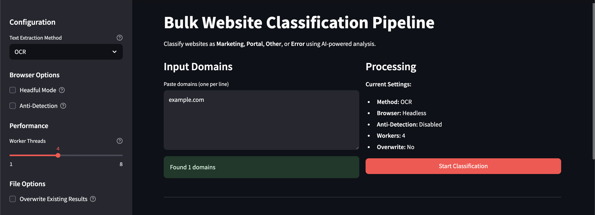
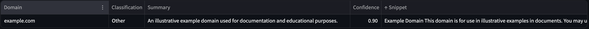

# AI Bulk Website Classifier

This project scans a list of domains, fetches page HTML and screenshots, extracts text via BeautifulSoup and locally run OCR, and classifies sites using OpenAI's API (Or Azure OpenAI) with function calling.

## Prerequisites

- Python 3.8+
- Tesseract OCR installed:
  - **macOS**: `brew install tesseract`
  - **Windows**: 
    - Option 1: Download installer from [GitHub releases](https://github.com/UB-Mannheim/tesseract/wiki)
    - Option 2: Using Chocolatey: `choco install tesseract`
    - Option 3: Using conda: `conda install -c conda-forge tesseract`
- [Playwright browsers](https://playwright.dev/python/docs/installation) installed

## Setup

1. Clone the repository and navigate to the project folder.
2. Create and activate a virtual environment:
   ```bash
   python3 -m venv venv
   source venv/bin/activate
   ```
3. Install Python dependencies:
   ```bash
   pip install -r requirements.txt
   ```
4. Install Playwright browsers:
   ```bash
   playwright install
   ```
5. Create a `.env` file in the project root with your OpenAI API key:
   ```dotenv
   OPENAI_API_KEY=your_api_key_here
   ```

### Azure OpenAI Setup (Alternative)

If you prefer to use Azure OpenAI instead of OpenAI directly:

1. Set up an Azure OpenAI resource in the Azure portal
2. Deploy a GPT-4.1-nano model in your Azure OpenAI resource
3. Create a `.env` file with Azure-specific configuration:
   ```dotenv
   AZURE_OPENAI_API_KEY=your_azure_api_key_here
   AZURE_OPENAI_ENDPOINT=https://your-resource-name.openai.azure.com/
   AZURE_OPENAI_API_VERSION=2024-02-15-preview
   AZURE_OPENAI_DEPLOYMENT_NAME=your-gpt-4-1-nano-deployment-name
   ```
4. Update `src/openai_client.py` to use Azure OpenAI:
   ```python
   # Replace the client initialization with:
   from openai import AzureOpenAI
   client = AzureOpenAI(
       api_key=os.getenv("AZURE_OPENAI_API_KEY"),
       api_version=os.getenv("AZURE_OPENAI_API_VERSION"),
       azure_endpoint=os.getenv("AZURE_OPENAI_ENDPOINT")
   )
   
   # Update the model name in the API call to your deployment name:
   model=os.getenv("AZURE_OPENAI_DEPLOYMENT_NAME")
   ```

## Input

- `domains.txt`: Newline-separated domains to classify (e.g., `example.com`).
- `test_domains.txt`: A smaller list of domains for testing purposes.

## Usage

The project provides a robust command-line interface for website classification:

### `run_CLI_pipeline.py` (Command-Line Pipeline)

This script offers more granular control, especially for websites that might block headless browsers or employ bot detection.

**Key Features & Options:**

*   **`--method [html|ocr|both]`**: (Default: `html`) Specifies the text extraction method.
*   **`--domains <filepath>`**: (Default: `domains.txt`) Path to the input file containing domains.
*   **`--output <filepath>`**: (Default: `results_enhanced.csv`) Path to the output CSV file.
*   **`--headful`**: Runs the browser in headful mode (UI visible). Useful for sites that block headless browsers. When using this, the number of workers is automatically limited to 2.
*   **`--anti-detection`**: Enables various anti-bot detection measures (e.g., user-agent spoofing).
*   **`--workers <number>`**: (Default: `4`) Number of parallel threads for processing domains.
*   **`--overwrite`**: If specified, the script will re-process all domains in the input list and overwrite the output file. By default (if this flag is not present), the script will skip domains already found in the output file and append new results.

**Example Commands:**

```bash
# Run with HTML extraction, default settings
python run_CLI_pipeline.py

# Run with OCR, headful mode, and anti-detection for a specific domain list
python run_CLI_pipeline.py --method ocr --headful --anti-detection --domains test_domains.txt --output test_ocr_results.csv --workers 1

# Run with 'both' methods, overwriting previous results
python run_CLI_pipeline.py --method both --overwrite --domains domains.txt --output all_results_fresh.csv
```

Results will be written to `results_enhanced.csv` by default (or the file specified by `--output`) with columns: `domain`, `classification_label`, and `summary`.

## Customization

### Adding Your Own Classification Labels

You can add your own classification categories by modifying the `openai_client.py` file:

1. Open `src/openai_client.py`
2. Find the `CLASSIFY_SITE_TOOL` dictionary definition
3. Locate the `classification_label` property and update the enum values:

```python
"classification_label": {
    "type": "string", 
    "enum": ["Marketing", "Portal", "Other", "Error", "YourNewCategory"],
    "description": "The primary classification category: 'Marketing', 'Portal', 'Other', 'Error', or 'YourNewCategory'"
},
```

4. You may also want to update the system message in the `classify_site` function to inform the AI about your new category and when to use it.

Remember to update your classification logic if you also use the Streamlit interface.

